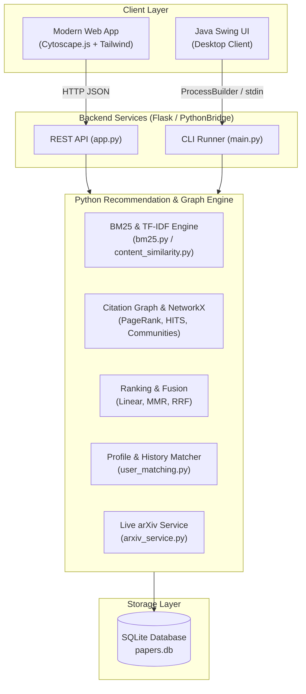

# 📚 Smart Research Paper Recommendation & Citation Graph System (SRPS v2.0)

[](tests/)
[](https://www.python.org/)
[](https://flask.palletsprojects.com/)
[](https://networkx.org/)
[](https://www.kluniversity.in/)

An advanced, intelligent research discovery engine that blends **Information Retrieval (BM25 + TF-IDF)**, **Network Science & Graph Theory (PageRank, HITS, Modularity Communities)**, and **Personalized Multi-Signal Ranking (MMR & RRF)** with an interactive **Cytoscape.js citation network explorer**, live **arXiv ingestion**, and a **Java Swing desktop client**.

> **Course Project — KL University, Dept. of Computer Science & Engineering, Section A7 (Group 5)**

---

## 👥 Team Members

| Name | Roll No. | Role & Contribution |
|---|---|---|
| **Abhinay Sai** | 2510030103 | Project Lead, System Architecture & Full-Stack Integration |
| **K V Srinath** | 2510030106 | Backend Services, SQLite Database & Schema Extensions |
| **Poli Naidu** | 2510030160 | Machine Learning, BM25 & NLP Information Retrieval Engine |
| **Chandu** | 2510030083 | Graph Algorithms, Network Science & Quality Assurance |

---

## 🚀 Key Features & DSA 3 Innovations

### 1. Advanced Graph Algorithms & Network Science
- **Directed Citation Graph ($G = (V, E)$)**: Models scholarly lineage where papers are vertices and citations are directed edges.
- **PageRank Algorithm**: Quantifies recursive citation authority using random surfer dynamics with damping factor $\alpha = 0.85$.
- **Personalized PageRank (Random Walk with Restart - RWR)**: Teleportation probability biased towards query-relevant seed papers or user history.
- **Kleinberg's HITS Algorithm**: Separates papers into **Authorities** (highly cited seminal works) and **Hubs** (comprehensive surveys citing good authorities).
- **Thematic Community Detection**: Automatically discovers research subfields using greedy modularity maximization ($Q$).
- **Citation Lineage & Shortest Path**: Bidirectional BFS to trace historical development between any two papers.

### 2. State-of-the-Art Information Retrieval
- **Okapi BM25 Ranking Framework**: Robust probabilistic relevance scoring with document length normalization ($b=0.75$) and term frequency saturation ($k_1=1.5$).
- **TF-IDF Vector Space Model**: Unigrams + bigrams with sublinear term-frequency scaling and stopword pruning.
- **Hybrid Content Fusion**: Blends BM25 keyword matching with dense TF-IDF cosine similarity.

### 3. Diversity-Preserving & Multi-Criteria Ranking
- **Weighted Multi-Signal Fusion**: Real-time tuning of Content ($\alpha$), Citation ($\beta$), User Profile ($\gamma$), and Recency ($\delta$).
- **Maximal Marginal Relevance (MMR)**: Greedy selection balancing relevance and novelty to prevent redundant recommendations.
- **Reciprocal Rank Fusion (RRF)**: Scale-invariant combination of disparate ranking signals:
  $$RRF\_Score(d) = \sum_{m \in M} \frac{1}{k + r_m(d)}$$
- **Temporal Recency Decay**: Exponential half-life decay modeling obsolescence or recent breakthroughs.

### 4. Interactive Web Application & Tools
- **Cytoscape.js Network Visualizer**: Interactive 2D force-directed citation graph with cluster coloring, node sizing, and path highlights.
- **My Saved Research Library**: Bookmark papers with custom notes and reading status (`To Read`, `Reading`, `Completed`).
- **Live arXiv Search & Ingest**: Query the official arXiv API live and import preprints into your local graph with 1 click.
- **Citation Exporter**: Instant BibTeX, APA 7th, and MLA 9th reference generation.
- **Legacy Java Swing UI**: Full desktop client connecting to the engine via JDBC and process bridge.

---

## 🏛️ System Architecture



---

## 📂 Project Structure

```
A7_DSA3_G5_PROJ/
├── app.py                      # Flask REST API and web application server
├── requirements.txt            # Python dependencies
├── vercel.json                 # Vercel deployment configuration
├── database/
│   ├── schema.sql              # Database schema (papers, citations, users, bookmarks)
│   └── papers.db               # SQLite database
├── data/
│   └── seed_data.py            # Seeding script with 50+ benchmark papers and citations
├── python_engine/
│   ├── __init__.py
│   ├── main.py                 # CLI entrypoint for Java bridge & command line
│   ├── db.py                   # SQLite CRUD operations & connection manager
│   ├── bm25.py                 # Okapi BM25 information retrieval algorithm
│   ├── content_similarity.py   # TF-IDF, bigrams, and hybrid similarity
│   ├── citation_graph.py       # PageRank, HITS, PPR, Shortest Path, Communities
│   ├── user_matching.py        # User profile & reading history matcher
│   ├── ranking.py              # Multi-signal fusion, MMR diversity, RRF
│   ├── arxiv_service.py        # Live arXiv API integration
│   ├── export.py               # BibTeX, APA, and MLA citation formatters
│   └── keyword_extractor.py    # Statistical and TF-IDF keyword extraction
├── templates/
│   └── index.html              # Modern responsive UI with Cytoscape.js
├── java_ui/                    # Java Swing desktop client
│   ├── pom.xml
│   └── src/main/java/com/srps/
│       ├── App.java
│       ├── db/DatabaseManager.java
│       ├── engine/PythonBridge.java
│       ├── model/Paper.java, Recommendation.java, User.java
│       └── ui/LoginFrame.java, MainFrame.java, ResultsPanel.java, ProfilePanel.java
└── tests/                      # Automated test suite (38 passing tests)
    ├── test_bm25.py
    ├── test_advanced_graph.py
    ├── test_citation_graph.py
    ├── test_content_similarity.py
    ├── test_ranking.py
    ├── test_ranking_advanced.py
    ├── test_user_matching.py
    ├── test_export.py
    └── test_api.py
```

---

## 🛠️ Setup & Running

### Prerequisites
- **Python 3.8+** with pip
- **Java 11+** (for optional Java Swing client)

### 1. Install Python Dependencies
```bash
pip install -r requirements.txt
```

### 2. Seed the Database
```bash
python data/seed_data.py
```
*Populates `database/papers.db` with 50 curated research papers, 87 directed citations, and test user accounts.*

### 3. Run Automated Tests
```bash
python -m pytest tests/ -v
```
*Executes all 38 unit and integration tests across algorithms and API endpoints.*

### 4. Launch the Web Application
```bash
python app.py
```
Open **[http://localhost:5000](http://localhost:5000)** in your browser to access the interactive dashboard.

### 5. (Optional) Run via CLI
```bash
python -m python_engine.main --query "deep learning image classification" --top_k 5 --algorithm hybrid
```

---

## 🌐 REST API Reference

| Endpoint | Method | Description |
|---|---|---|
| `/` | `GET` | Interactive Web Dashboard (Cytoscape + Tailwind) |
| `/login` | `GET` | Dedicated Sign In & Account Registration Page |
| `/api/login` | `POST` | Authenticate user account |
| `/api/register` | `POST` | Register new researcher account with interests |
| `/api/user/<id>` | `GET` | Retrieve user profile & research interests |
| `/api/user/interests` | `POST` | Update user research interest profile |
| `/api/recommend` | `POST` / `GET` | Get recommendations (`query`, `user_id`, `top_k`, `algorithm`, `weights`) |
| `/api/papers` | `GET` / `POST` | List all papers or create a new paper |
| `/api/papers/<id>` | `GET` | Get paper details with citing and cited papers |
| `/api/graph/data` | `GET` | Node and edge data for Cytoscape.js visualization |
| `/api/graph/path` | `GET` | Shortest citation path between `source_id` and `target_id` |
| `/api/graph/analytics` | `GET` | Network metrics (density, degrees, HITS, PageRank) |
| `/api/bookmarks` | `GET` / `POST` | View or add bookmarked papers |
| `/api/bookmarks/<id>` | `DELETE` | Remove paper from saved library |
| `/api/arxiv/search` | `GET` | Search live arXiv preprints |
| `/api/arxiv/import` | `POST` | Ingest an arXiv preprint into database and citation graph |
| `/api/export/bibtex` | `GET` | Export paper or library as BibTeX `.bib` file |

---

## 📜 License & Academic Integrity

Developed as a Course (PBL) Project for **Data Structures and Algorithms 3 (DSA-3)** at **KL University, Department of Computer Science & Engineering**. Intended for educational and academic research purposes.
